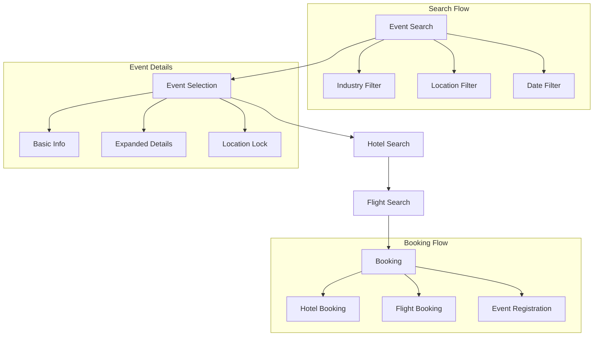

# Business Holiday Booking Platform

Internal development repository for the Business Holiday Booking platform - combining professional events with leisure travel opportunities.

## 🗺️ Application Flow



### Event Browsing
- Event cards with basic information
- Expandable details view:
  - Full description
  - Website URL
  - Ticket pricing
  - Location details

### Event Selection
- Location locking system
- Automatic hotel search trigger
- Progress tracking

### Hotel Selection
- Location-based filtering
- Price range options
- Booking.com integration
- Availability checking

### Flight Selection
- Origin airport input
- Date flexibility
- WayAway integration
- Price tracking

## 🔌 External Integrations

### Affiliate APIs
- **Booking.com**
  - Hotel search and pricing
  - Real-time availability
  - Commission tracking
  - Deep linking system

- **WayAway**
  - Flight search API
  - Price comparison
  - Booking management
  - Analytics integration

### Content Management
- **Strapi CMS**
  - Event content management
  - Media handling
  - Dynamic updates
  - API-first approach

### Analytics
- User flow tracking
- Conversion monitoring
- Affiliate link tracking
- Performance metrics

## 🚀 Quick Start

### Prerequisites
- Docker and Docker Compose
- Node.js 20+ (for local development)
- Git

### Development Setup
1. Clone the repository:
   ```bash
   git clone [repository-url]
   cd business-holiday-booking
   ```

2. Set up environment variables:
   ```bash
   # Frontend environment setup
   cp frontend/.env.example .env.frontend
   
   # Backend environment setup
   cp backend/.env.example .env.backend
   ```

   Configure the environment files:
   - `.env.frontend`:
     ```
     NEXT_TELEMETRY_DISABLED=1                # Disable Next.js telemetry
     ```
   Note: 
   - NODE_ENV is automatically set to "development" in docker-compose.dev.yml
   - BACKEND_URL is set to "http://backend:5000" in docker-compose.dev.yml
   - API requests are proxied through Next.js API routes in development
   - In production, NEXT_PUBLIC_API_URL is set via Vercel environment variables
   - `.env.backend` (documentation in backend/.env.example)

3. Start the development environment:
   ```bash
   make updev
   ```

4. Access the applications:
   - Frontend: http://localhost:3000
   - Backend API: http://localhost:5000
   - Prisma Studio: http://localhost:5555
   - Database: localhost:5432

## 🌐 Environment Separation

The project maintains strict separation between development and production environments:

### Development Environment
- Uses `docker-compose.dev.yml`
- Includes development tools (Prisma Studio, pgweb)
- Local PostgreSQL database with volumes
- Next.js API routes proxy requests to backend
- Container-to-container communication
- Hot reloading enabled
- Started with `make updev` or `make rebuilddev`

### Production Environment
- Frontend deployed to Vercel
  - Direct API calls to backend URL
  - Environment variables managed in Vercel dashboard
  - No proxy overhead
- Backend deployed to Render
  - Minimal Docker configuration
  - Connects to Render PostgreSQL
  - Environment variables managed in Render dashboard

## 🏗 Project Structure

```
business-holiday-booking/
├── frontend/               # Next.js frontend application
│   ├── src/               # Source code
│   │   ├── components/    # React components
│   │   ├── pages/        # Next.js pages
│   │   │   └── api/      # API routes for development
│   │   └── services/     # Shared services
│   │       └── api.ts    # Centralized API service
│   ├── public/           # Static assets
│   └── Dockerfile.dev    # Development Docker configuration
├── backend/              # Express.js API server
│   ├── src/             # Source code
│   └── Dockerfile.dev   # Development Docker configuration
├── docs/                # Project documentation
│   ├── activeContext.md  # Current development focus
│   ├── productContext.md # Product vision and goals
│   ├── systemPatterns.md # Architecture patterns
│   └── techContext.md    # Technical specifications
├── docker-compose.yml    # Production container config
└── docker-compose.dev.yml # Development container config
```

## 📚 Documentation

- [Product Context](docs/productContext.md) - Why this exists
- [Active Context](docs/activeContext.md) - Current focus and recent changes
- [System Patterns](docs/systemPatterns.md) - Architecture and API patterns
- [Technical Context](docs/techContext.md) - Tech stack and environment setup
- [Codebase Summary](docs/codebaseSummary.md) - Code overview

## 🔄 Development Workflow

1. Create feature branch from `main`
2. Implement changes
3. Run tests (when implemented)
4. Create PR with:
   - Clear description
   - Link to related issue
   - Screenshots (if UI changes)
5. Get code review
6. Merge to `main`

## 🧪 Testing

- Frontend: (TBD)
- Backend: (TBD)
- Integration: (TBD)

## 📦 Deployment

- Frontend → Vercel
- Backend → Render
- Database → Supabase

## 🛠 Common Tasks

### Troubleshooting

### Environment Management

**Critical Variables**
- Development:
  - `BACKEND_URL`: Set to `http://backend:5000` in docker-compose.dev.yml
    - Used by Next.js API routes to proxy requests
    - Container-to-container communication
    - Automatic request proxying
- Production:
  - `NEXT_PUBLIC_API_URL`: Set in Vercel dashboard
    - Direct API communication
    - No proxy overhead
    - Points to Render backend URL

**External API Keys**
```bash
# Booking.com Integration
BOOKING_COM_AFFILIATE_ID=
BOOKING_COM_API_KEY=

# WayAway Integration
WAYAWAY_PARTNER_ID=
WAYAWAY_API_KEY=

# CMS Integration
STRAPI_API_TOKEN=

# Analytics
GA_MEASUREMENT_ID=
CONVERSION_TRACKING_ID=
```

```bash
# Development commands
make updev       # Start dev environment
make downdev     # Stop dev environment
make rebuilddev  # Rebuild dev environment

# Production-style commands
make up          # Start production-like environment
make down        # Stop production-like environment
make rebuild     # Rebuild production-like environment
```

### Database Management
```bash
# Generate Prisma client
docker compose exec backend npx prisma generate

# Run migrations
docker compose exec backend npx prisma migrate dev

# Reset database (caution: deletes all data)
docker compose exec backend npx prisma migrate reset

# Access Prisma Studio (dev only)
open http://localhost:5555
```

### Auto-Test Data Import

When running the backend in development mode, a CSV import script automatically runs on startup. This ensures your development database always has test data available.

The import process:
- Reads from `/backend/import/events.csv`
- Only runs when `NODE_ENV=development`
- Checks for duplicates using `externalId`
- Skips existing events
- Maps image paths automatically
- Includes region data (continent) for each event

**Region Field Details:**
- Required field in CSV (column name: "region")
- Valid values: "Europe", "Asia", "North America", "South America", "Africa", "Oceania"
- Used for filtering events by continent
- Stored in database as plain text

You can also manually trigger the import:
```bash
docker compose exec backend npm run import:dev-data
```

To skip the auto-import:
- Set `NODE_ENV=production` in your environment
- Or remove the import step from the `dev` script in `backend/package.json`

### Adding Dependencies
```bash
# Frontend
docker compose exec frontend npm install [package-name]

# Backend
docker compose exec backend npm install [package-name]
```

### Running Tests (TBD)
```bash
# Frontend
docker compose exec frontend npm test

# Backend
docker compose exec backend npm test
```

## 🤝 Contributing

1. Follow the branching strategy
2. Keep PRs focused and atomic
3. Update documentation
4. Add tests for new features
5. Follow existing code style

## 📝 License

Internal use only - Not for distribution
