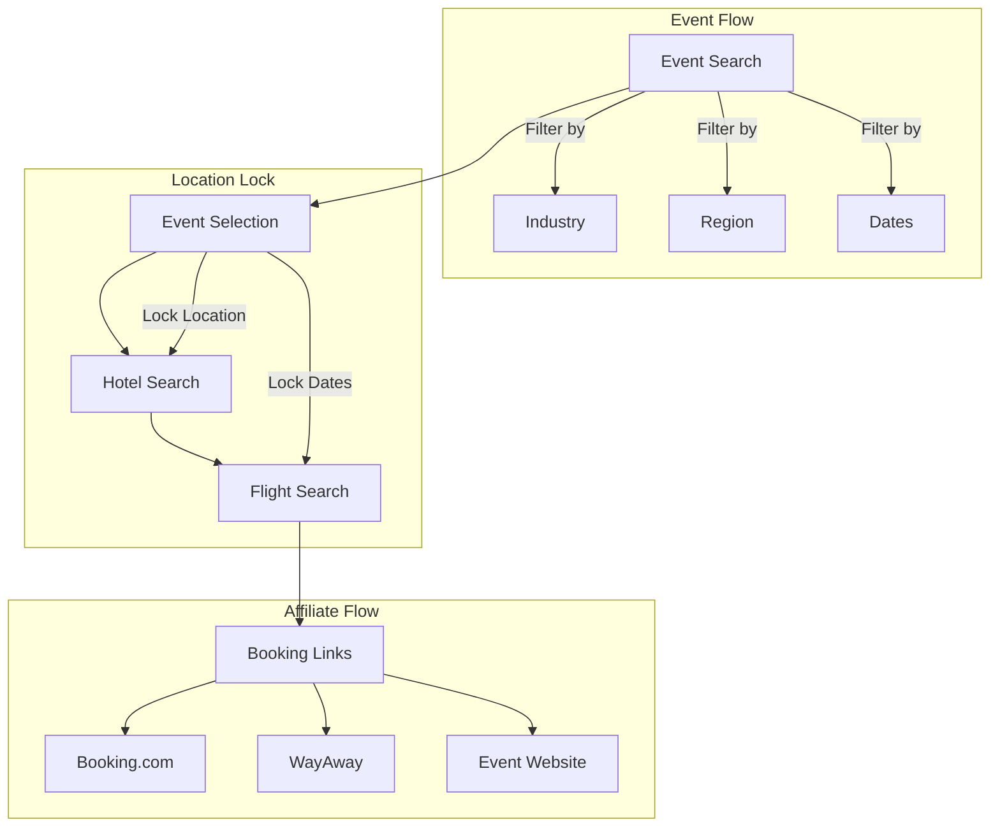
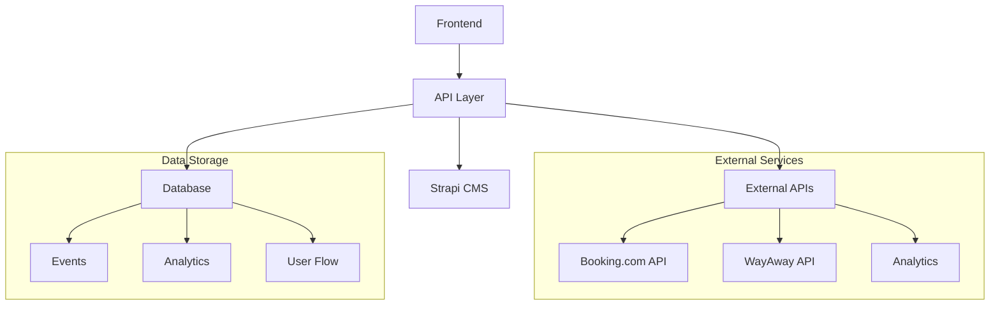
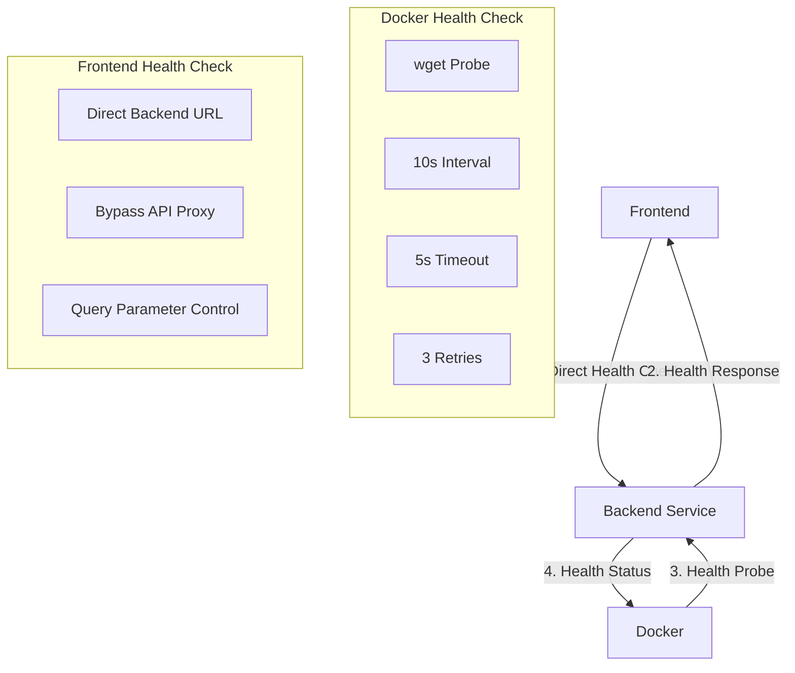
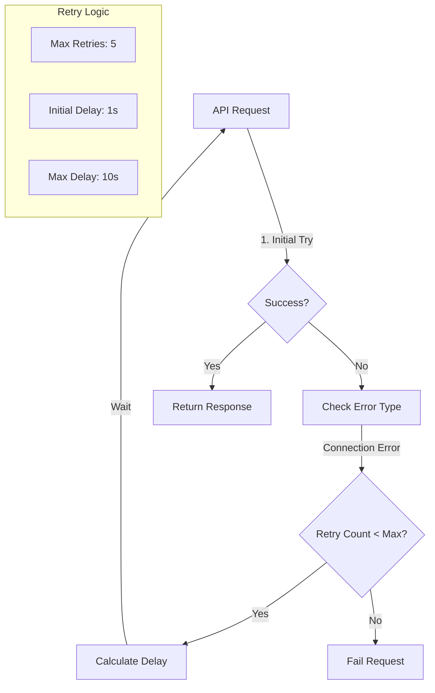
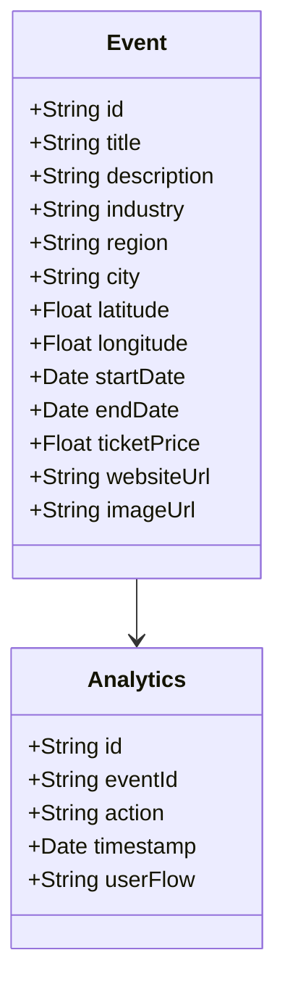
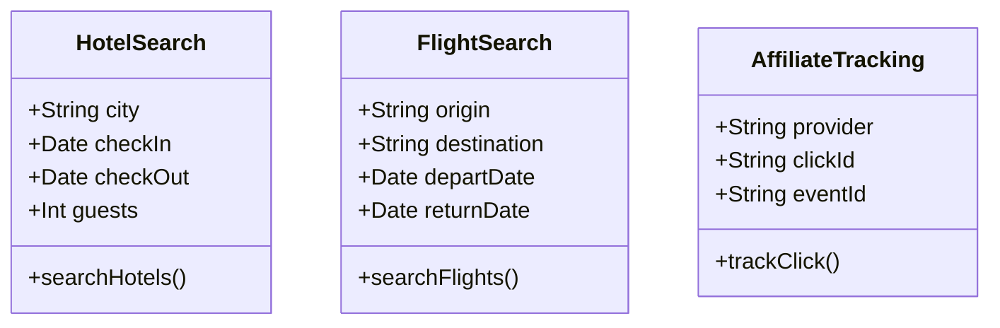

# systemPatterns.md

## 🧠 How the System is Built
A lightweight web platform using modern JAMstack principles:
- Static frontend served via CDN (Next.js + TailwindCSS)
- Dynamic content loaded via REST API (Node.js + Express + TypeScript)
- Prisma ORM for type-safe database access
- External booking flows via affiliate APIs (Booking.com, WayAway)

## 🧱 Key Technical Decisions
- Use affiliate links for booking = no regulatory overhead
- No authentication = lower complexity and faster development
- CSV-based event import = flexible data management
- Automatic development data = consistent testing environment
- Real-time API fetches for hotels/flights = always fresh data
- Click tracking for affiliate analytics
- Multi-stage Docker builds = optimized production images
- Prisma for type-safe database access = reduced runtime errors
- Environment-based configuration = flexible deployment options
- Next.js API routes for development = simplified local setup

## 🧰 Architecture Patterns

### 🔄 User Flow Architecture

### 🎯 Data Flow Architecture

### API Layer Design

#### Development Environment
- **Next.js API Routes**:
  - Proxy requests to backend
  - Container-to-container communication
  - Hot reloading support
  - Local debugging capabilities

#### Production Environment
- **Direct Communication**:
  - Direct API calls to backend URL
  - Environment variables from Vercel/Render
  - Optimized for performance
  - No proxy overhead

#### Health Check Pattern

- **Docker Health Check**:
  - wget-based health probing
  - 10-second check interval
  - 5-second timeout
  - 3 retry attempts
  - 10-second startup grace period

- **Frontend Health Check**:
  - Direct backend URL access
  - Proxy bypass via query params
  - Startup coordination
  - Service readiness verification
  - Connection status monitoring

- **Health Check Flow**:
  - Docker monitors backend health
  - Frontend waits for backend readiness
  - Direct health check requests
  - Status propagation to UI

#### Retry Pattern

- **Retry Configuration**:
  - Maximum 5 retry attempts
  - Initial 1-second delay
  - Exponential backoff
  - Maximum 10-second delay
  - Connection error detection

- **Implementation Levels**:
  - API Service layer
  - Component level
  - Proxy route level
  - Health check endpoint

### 🏗 Core Patterns
- **Modular monolith**: Single repo, structured folders by domain (api, ui, db)
- **Component-based UI**: Reusable components (HeroBanner, SelectField, DestinationSelect)
- **RESTful API design**: Simple JSON contracts (/api/events)
- **Static + dynamic hybrid**: Pre-rendered pages + API-interpolated content
- **Incremental adoption**: Easy to replace/scale any part later

### 🐳 Docker Architecture
- **Docker-first development**: 
  - Consistent environments across team
  - Volume mounts for hot reloading
  - Environment-specific configurations
  - Container networking for local development

### 📊 Data Layer

#### Event Data Model

#### Integration Models

- **Type-safe data layer**: Prisma schema as single source of truth
- **Environment Configuration**:
  - Service-specific .env files
  - Public vs private variables separation
  - Docker-compatible env management
- **Development Data Management**:
  - Auto-import on startup in dev mode
  - External ID tracking for deduplication
  - Structured image path mapping
  - Environment-aware data loading

### 🔌 API Service Pattern
- **Centralized API Service**:
  - Single source of truth for API calls
  - Environment-aware base URL configuration
  - Unified error handling
  - Type-safe interfaces
  - Prevents duplicate requests
  - Consistent request/response patterns

### 📱 User Interface Patterns
- **Progressive Disclosure**:
  - Show basic event info first
  - Expand details on interaction
  - Step-by-step booking flow
- **State Management**:
  - Location locking
  - Search parameters
  - User flow tracking
- **Error Handling**:
  - Graceful degradation
  - Informative messages
  - Retry mechanisms
- **Loading States**:
  - Skeleton screens
  - Progress indicators
  - Optimistic updates

### 🔍 Search Patterns
- **Event Search**:
  - Industry filtering
  - Location-based results
  - Date range filtering
- **Hotel Search**:
  - Location-locked search
  - Price range filtering
  - Amenity filtering
- **Flight Search**:
  - Origin airport selection
  - Date flexibility
  - Price tracking

## 🛡️ Principles Followed
- Keep it simple (KISS)
  - Clear separation of development/production environments
  - Intuitive API service design
  - Minimal configuration needed
- Build only what's needed (YAGNI)
  - Environment-specific optimizations
  - No unnecessary abstractions
- DRY (Don't Repeat Yourself)
  - Centralized API logic
  - Reusable components
  - Shared type definitions
- Secure by default
  - Don't store unnecessary data
  - Environment-based security
- Fail gracefully
  - Timeout-safe APIs
  - Loading states
  - Error boundaries
- Scale with confidence
  - No single point of failure
  - Environment-specific optimizations
- Type safety over convenience
  - TypeScript + Prisma
  - Strict type checking
